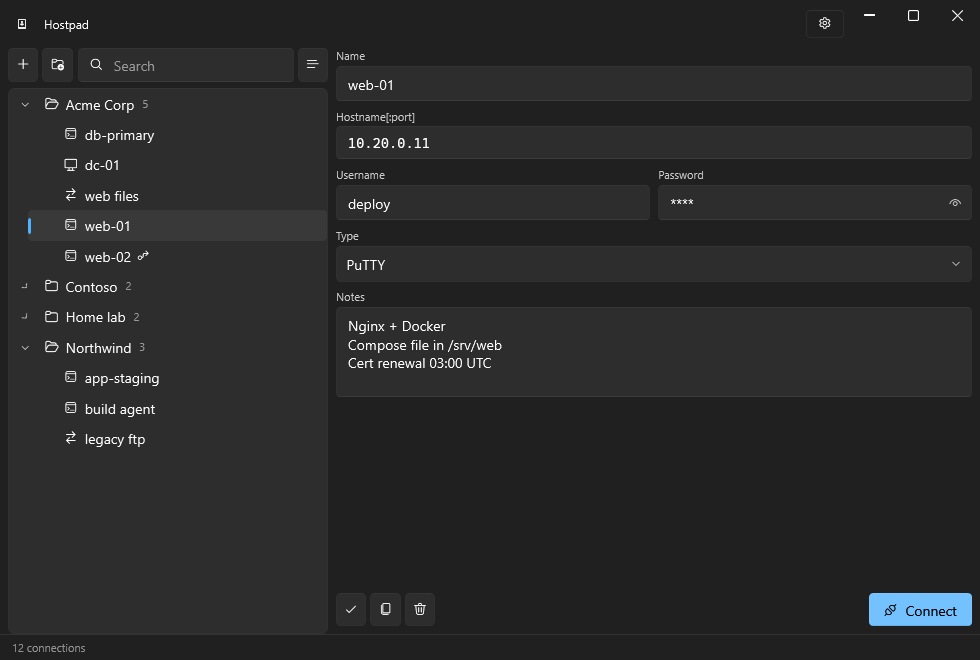

<p align="center">
  
</p>

<h1 align="center">Hostpad</h1>

<p align="center">
  A connection manager for Windows. Keep every remote machine in one place and
  open it with a double click — SSH, SFTP, SCP, FTP, Remote Desktop or VNC,
  through the client tools you already use.
</p>

<p align="center">
  <a href="https://github.com/goodmagma/Hostpad/releases/latest"><strong>Download the latest release</strong></a>
</p>



## Why

A good connection manager is an address book, not another terminal. Hostpad
keeps the list, the credentials and the notes; PuTTY, WinSCP, mstsc and your VNC
viewer keep doing what they are good at.

The idea comes from [AutoPuTTY](https://github.com/r4dius/AutoPuTTY), a tool
that did this job well for many years. Hostpad is freely inspired by it — no
fork, no shared code, written from scratch — and brings the idea up to date:
folders, real encryption, a Windows 11 interface, and the fields that used to be
encoded inside other fields turned into fields of their own.

## Features

**Organise**

- Folders with nesting, plus connections that belong to no folder at all
- Drag and drop to move connections between folders and to reorganise folders
- Rename in place with F2
- Search across name, hostname, username and notes, which flattens the tree
  while you are hunting
- Switch between the folder tree and one flat list
- A notes field per connection, for the things you always forget

**Connect**

- Six connection types: PuTTY, Remote Desktop, VNC, and WinSCP in its SFTP, SCP
  and FTP modes
- Double click connects with the type you chose; the right-click menu opens the
  same host with any of the others
- SSH jump hosts as real fields, tunnelled through plink, instead of a proxy
  string smuggled into the username
- Private key authentication, post-login commands and X11 forwarding for PuTTY
- Screen size, mounted drives, multiple monitors and admin sessions for Remote
  Desktop
- Full screen and view-only for VNC, passive mode for FTP

**Protect**

- The connection list is encrypted with AES-256-GCM, always
- Without a master password the vault is tied to your Windows account through
  DPAPI: no prompt, and useless to anyone who copies the file
- With a master password it also opens on another computer, which is what makes
  a backup worth having. Asking for it at startup is a separate choice, so you
  can have portability without the interruption
- Passwords are derived with PBKDF2-HMAC-SHA256, and the iteration count lives
  in the file so it can be raised later without breaking existing vaults
- Changing the master password rewraps a key rather than re-encrypting
  everything, so it is instant at any size

**Move data in and out**

- Import from AutoPuTTY, including passwords, notes, folders recovered from name
  prefixes, jump hosts, and optionally the tool paths
- Export a password-protected copy to share, with a choice of whether to include
  the saved credentials — sharing a server list rarely means handing over the
  root passwords
- Import merges rather than replaces, and asks what to do about names that
  already exist

**Everyday details**

- Follows the Windows light and dark theme, with Mica and rounded corners
- Offers to save when unsaved edits are about to be lost, including on close
- Remembers window position, size and pane widths, and refuses to restore onto a
  monitor that is no longer there
- Saves atomically, keeping a backup, so a crash mid-save cannot truncate your
  connection list
- Single instance, so a second launch does not open a second window

## Requirements

- Windows 10 or 11
- [.NET 10 Desktop Runtime](https://dotnet.microsoft.com/download/dotnet/10.0),
  unless you take `Hostpad-<version>-win-x64.exe`, which carries the runtime
  inside it and needs nothing installed
- The client tools you intend to use: PuTTY, WinSCP, a VNC viewer. Remote Desktop
  ships with Windows

Your data lives in `%USERPROFILE%\.hostpad`.

## Building

Building needs the .NET 10 **SDK**, which is a different package from the
runtime above. Install it with winget:

```bash
winget install Microsoft.DotNet.SDK.10
```

Open a new terminal afterwards, so the updated PATH is picked up, and check the
SDK is visible:

```bash
dotnet --list-sdks
```

The output must include a `10.x` entry. If `dotnet` is found but no 10.x SDK is
listed, only the runtime is installed and the build will fail on the target
framework.

Then, from the repository root:

```bash
dotnet build
```

```bash
dotnet test
```

```bash
dotnet run --project Hostpad.App
```

Visual Studio 2022 17.14 or later opens `Hostpad.sln` directly. Set
`Hostpad.App` as the startup project.

Warnings are errors in this repository, so a build that prints nothing is a
build that passed.

Bug reports, ideas and patches are welcome:
[CONTRIBUTING.md](CONTRIBUTING.md) covers how the code is arranged, what the
tests expect and how a change gets in.

## Migrating from AutoPuTTY

Use **Import from AutoPuTTY** in the settings menu and point it at an existing
`autoputty.xml`. The original file is left untouched.

Passwords and comments come across, and two AutoPuTTY conventions become real
structure: a name like `Customer: server` turns into a folder plus a name, and
the `proxyuser@proxyhost:port#user` jump syntax becomes a jump host with its own
fields. Tool paths and options can be imported too, if you want them.

If the list was protected by an AutoPuTTY master password, Hostpad asks for it.
Otherwise it opens the file with AutoPuTTY's built-in key.

> An `autoputty.xml` without a master password is encrypted with a key published
> in AutoPuTTY's own source, so anyone can read it. Treat such files as
> plaintext: they hold hostnames, usernames and passwords.

## How it is built

Two projects. `Hostpad.Core` holds the model, storage, cryptography and the
command building for each tool, with no user interface and no Windows-only API
outside the one class that talks to DPAPI. `Hostpad.App` is WPF with
[WPF-UI](https://github.com/lepoco/wpfui).

The launchers produce a command and hand it back rather than starting a process
themselves, which is what lets the argument building be tested without spawning
anything.

## Built with

Hostpad stands on a short list of other people's work:

- [WPF-UI](https://github.com/lepoco/wpfui) by Leszek Pomianowski and
  contributors — the Windows 11 look, MIT
- [.NET Community Toolkit](https://github.com/CommunityToolkit/dotnet) — the MVVM
  source generators, MIT
- [.NET](https://github.com/dotnet/runtime) — the runtime, WPF and the DPAPI
  wrapper the vault is built on, MIT

Development also leans on [xUnit](https://github.com/xunit/xunit) for the test
suite, which is not part of anything shipped.

Full copyright notices are in
[THIRD-PARTY-NOTICES.md](THIRD-PARTY-NOTICES.md), which is also included in
every download.

## About this project

Hostpad is freely inspired by [AutoPuTTY](https://github.com/r4dius/AutoPuTTY)
by r4dius. It is not a fork and shares no code with it: the application was
written from scratch on .NET 10 and WPF. Thanks to r4dius for the original idea
and for a tool that did the job for many years.

## Name and official builds

The source is free software under the GPL — fork it, modify it, redistribute it.
The **name "Hostpad" is not covered by that licence**: please rename your fork so
users can tell the projects apart.

The only official releases are published at
<https://github.com/goodmagma/Hostpad>. Copies distributed elsewhere, in
particular paid ones, are not from us.

## Licence

GNU General Public License v3.0 or later — see [LICENSE](LICENSE).

The bundled libraries keep their own licences, all MIT and all compatible with
the GPL; their notices are in
[THIRD-PARTY-NOTICES.md](THIRD-PARTY-NOTICES.md).
